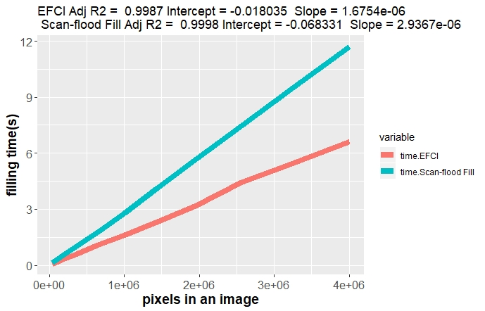

## Scan-flood Fill README

Explanations can be seen in our paper: file Scan-flood-Fill/56.pdf, or https://arxiv.org/abs/1906.03366

If you want to use our code, please cite our paper. This paper is submitted and accpeted for CEFRL 2019, a workshop in conjuction with CVPR, in Long Beach, California, United States.

### 1 Requirements

- python 2.7
- numpy
- cv2 (opencv)
- skimage
- time
- os

### 2 Dataset

​	The input images for our toy experiment are generated by dilation of eight 200 x 200  basic images.(see code dilation.py and \data\toy_example\input_200\)  Define the property 3-tuple of an image to be (multiple, border, holes), whose entries are all Boolean variables, to represent each of these eight cases. For example, (F,F,T)  means that the image has only one object inside, has no regions whose boundaries meet the border of the whole image but has "holes"  inside regions. This notation will be used to illustrate the comparison on toy examples. To show that our algorithm can also be useful in practical ground truth masks generating process, we also consider images in MSRA10K.

### 3 Overview

​	This Scan-flood Fill algorithm takes in folders of boundary images and output the following:

- mask  images. 

- running time for the model, both in terminal and in .csv files.(most python files)

​	Scan-flood Fill algorithm is an an efficient automatic precise region filling algorithm for complicated regions with the following advantages:

- In previous works, seed filling algorithms such as flood filling algorithm from OpenCV and boundary filling algorithms have been applied to generate filled masks. Although these are used in part of our approach, there exists a considerable difference in that our {\bf starting seeds are automatically provided} by the algorithm instead of being given beforehand. We propose to integrate seed filling algorithms and scan-line filling algorithms, together with the properties of adjacent connected regions, for complicated arbitrary region filling problems. 

- Besides, Scan-flood Fill(SCAFF) enables us to handle complicated regions such as a pig face and the examples from MSRA10K. This is by virtue of the classification of pixels, especially label pixels, and the Crop-and-"Inverse" process. We compare Scan-flood Fill(SCAFF) with its basic version EFCI for region filling. The results in Figure \ref{fig:Comparison} demonstrates the potential superiority of more precise algorithms taking the relationship between adjacent connected regions into account.

- Also, in Scan-flood Fill(SCAFF) algorithm, we do not need to worry about the potential existence of {\bf multiple regions inside an image}. This is because our filling algorithm does not require human-provided starting seeds, but can set starting seeds whenever needed. Moreover, since we start from filling exterior label color to the outermost exterior of an image, which is part of the background for the final result, we are able to avoid being trapped in a small region. 

- Moreover, padding with background color guarantees the robust filling result regardless of whether some boundaries of the regions in an image lie on the border of the whole image. 

### 4 Toy examples

​	We generate different sizes of input images by dilation of eight 200 x 200 basic images. The dilation code is Scan-flood-Fill/data/toy_examples/dilation.py, with input Scan-flood-Fill/data/toy_examples/input_200, and output is Scan-flood-Fill/data/toy_examples/output_toy.

​	We record time consumption for both EFCI and Scan-flood Fill and output corresponding .csv files. The corresponding codes are Scan-flood-Fill/filling_algorithms/EFCI_time_size.py and Scan-flood-Fill/filling_algorithms/Scan_flood_fill_time_size.py. The file Scan-flood-Fill/filling_algorithms/Scan_flood_fill_time_size_crop_first.py is the algorithm for Scan-flood-Fill, but it does cropping before the Main Filling Process. The resulting .csv files recording running time are EFCI_time_size.csv and Scan_flood_Fill_time_size.csv. The resulting masks are Scan-flood-Fill/data/toy_examples/output_EFCI_toy and Scan-flood-Fill/data/toy_examples/output_Scan_flood_Fill_toy(Scan-flood-Fill/data/toy_examples/output_Scan_flood_Fill_crop_first_toy for the cropping before Main Filling Process version).

​	A visual result for toy examples is given in the following figure.


​	Time comparison figure is presented here.

<p align="center">
  
</p>

​	EFCI code is given below:
```python
import numpy as np
import cv2
import time
import os

INPUT_PATH = 'F:/Scan-flood-Fill/data/toy_examples/input_toy/'
OUTPUT_PATH_FILL = 'F:/Scan-flood-Fill/data/toy_examples/output_EFCI_toy/'
background_threshold = 50
# pixel with difference less than this value with the background colour is seen as background colour

def del_file(path):
    # delete files
    for i in os.listdir(path):
        path_file = os.path.join(path, i)
        if os.path.isfile(path_file):
            os.remove(path_file)
        else:
            del_file(path_file)

def pad_with(vector, pad_width, iaxis, kwargs):
    pad_value = kwargs.get('padder', 0)
    vector[:pad_width[0]] = pad_value
    vector[-pad_width[1]:] = pad_value
    return vector

def readAndPad(imagePath, backGroundColour):
    img = cv2.imread(imagePath, 0)
    padImg = np.pad(img,1,pad_with, padder=backGroundColour)
    height, width = padImg.shape[:2]
    return padImg, height, width

def floodFill(img, height, width, x, y, boundaryColour, backGroundColour, fillColour):
    img[x, y] = fillColour
    if (x>0 and img[x-1, y] == backGroundColour):
        floodFill(img, height, width, x-1, y, boundaryColour, backGroundColour, fillColour)
    if (y>0 and img[x, y-1] == backGroundColour):
        floodFill(img, height, width, x, y-1, boundaryColour, backGroundColour, fillColour)
    if (x<(height-1) and img[x+1, y] == backGroundColour):
        floodFill(img, height, width, x+1, y, boundaryColour, backGroundColour, fillColour)
    if (y<(width-1) and img[x, y+1] == backGroundColour):
        floodFill(img, height, width, x, y+1, boundaryColour, backGroundColour, fillColour)

def cvFloodFill(img, height, width, fillColour):
    mask = np.zeros([height+2, width +2], np.uint8)
    cv2.floodFill(img, mask, (0, 0), newVal = fillColour, loDiff = 50, upDiff = 50, flags = 4)

def cropAndReverse(img, height, width, maskColour, backGroundColour, fillColour):
    croppedImg = np.delete((np.delete(img, [0, width-1], axis=1)), [0, height-1], axis=0)
    for x in range(height-2):
        for y in range(width-2):
            # fillColour is the color that is temporarily used to fill exterior
            # maskColour is for the final result (interior)
            if croppedImg[x,y] == fillColour:
                croppedImg[x,y] = backGroundColour
            elif abs(croppedImg[x,y] - backGroundColour) < background_threshold:
                croppedImg[x,y] = maskColour
    return croppedImg

def fillBoundaryMain(imagePath ,savePath):

    padImg, height, width = readAndPad(imagePath, backGroundColour = 0)
    cvFloodFill(padImg, height, width, 128)
    filledImg = cropAndReverse(padImg, height, width, 255, 0, 128)
    cv2.imwrite(savePath, filledImg, [int(cv2.IMWRITE_JPEG_QUALITY),100])

def fillBoundary_main():
    fill_time = np.zeros([10])
    for i, n in enumerate(range(200, 2200, 200)):
        output_folder_name = 'original_size_' + str(n)
        input_folder_name = 'input_' + str(n)
        input_path = os.path.join(INPUT_PATH, input_folder_name)
        output_path_fill = os.path.join(OUTPUT_PATH_FILL, output_folder_name)
        # delete previous files
        os.mkdir(output_path_fill)
        #uncomment to generate folder for the results
        del_file(output_path_fill)
        start = time.clock()
        for root, dirs, files in os.walk(input_path):
            for f in files:
                fillBoundaryMain(os.path.join(input_path, f), os.path.join(output_path_fill, f))
        elapsed = (time.clock() - start)
        print("Time used for size {} is:".format(str(n)))
        print(elapsed)
        fill_time[i] = elapsed
    print(fill_time)
    np.savetxt("EFCI_time_size.csv", fill_time, delimiter=",")
    
    if __name__ == '__main__':
    fillBoundary_main()
```

​	Scan-flood Fill code is given below:
```python
import numpy as np
import cv2
import time
import os

INPUT_PATH = 'F:/Scan-flood-Fill/data/toy_examples/input_toy/'
OUTPUT_PATH_FILL = 'F:/Scan-flood-Fill/data/toy_examples/output_Scan_flood_Fill_toy/'
colorThreshold = 35

def del_file(path):
    # delete files
    for i in os.listdir(path):
        path_file = os.path.join(path, i)
        if os.path.isfile(path_file):
            os.remove(path_file)
        else:
            del_file(path_file)

def pad_with(vector, pad_width, iaxis, kwargs):
    pad_value = kwargs.get('padder', 0)
    vector[:pad_width[0]] = pad_value
    vector[-pad_width[1]:] = pad_value
    return vector

def readAndPad(imagePath, backGroundColour):
    img = cv2.imread(imagePath, 0)
    padImg = np.pad(img,1,pad_with, padder=backGroundColour)
    height, width = padImg.shape[:2]
    return padImg, height, width

def cropAndReverse(img, height, width, backGroundColor, labelColor, fillColor, maskColor):
    croppedImg = np.delete((np.delete(img, [0, width-1], axis=1)), [0, height-1], axis=0)
    for x in range(height-2):
        for y in range(width-2):
            # label is the color that is temporarily used to fill exterior
            if croppedImg[x,y] == labelColor:
                croppedImg[x,y] = backGroundColor
            if croppedImg[x, y] == fillColor:
                croppedImg[x, y] = maskColor
    return croppedImg

def cvFloodFill(img, height, width, seedPosition, fillColor):
    mask = np.zeros([height+2, width +2], np.uint8)
    cv2.floodFill(img, mask, seedPosition, newVal = fillColor, loDiff = 50, upDiff = 50, flags = 4)

def holesInHoles(imgPath, savePath, backGroundColor, boundaryColor, labelColor, fillColor, maskColor):
    padImg, height, width = readAndPad(imgPath, backGroundColor)
    seedPosition = (0, 0)
    cvFloodFill(padImg, height, width, seedPosition, labelColor)
    for x in range(height):
        for y in range(width):
            pixelValue = padImg[x, y]
            if abs(pixelValue - backGroundColor) < colorThreshold:
                seedPosition = (y,x)
                i = 1
                while abs(padImg[x, y-i] - boundaryColor) < colorThreshold:
                    i = i + 1
                if abs(padImg[x, y-i] - labelColor) < colorThreshold:
                    cvFloodFill(padImg, height, width, seedPosition, fillColor)
                else:
                    cvFloodFill(padImg, height, width, seedPosition, labelColor)

    resultImg = cropAndReverse(padImg, height, width, backGroundColor, labelColor, fillColor, maskColor)
    cv2.imwrite(savePath, resultImg, [int(cv2.IMWRITE_JPEG_QUALITY), 100])
    
def holeFill_main():
    fill_time = np.zeros([10])
    boundaryColor = 255
    fillColor = 128
    labelColor = 80
    backGroundColor = 0
    maskColor = 255
    for i, n in enumerate(range(200, 400, 200)):
        output_folder_name = 'improved_size_' + str(n)
        input_folder_name = 'input_' + str(n)
        input_path = os.path.join(INPUT_PATH, input_folder_name)
        output_path_fill = os.path.join(OUTPUT_PATH_FILL, output_folder_name)
        #os.mkdir(output_path_fill)
        #uncomment to generate folder for the results
        # delete previous files
        del_file(output_path_fill)
        start = time.clock()
        for root, dirs, files in os.walk(input_path):
            for f in files:
                holesInHoles(os.path.join(input_path, f), os.path.join(output_path_fill, f), backGroundColor, boundaryColor, labelColor, fillColor, maskColor)
        elapsed = (time.clock() - start)
        print("Scan-flood Fill time used for size {} is:".format(str(n)))
        print(elapsed)
        fill_time[i] = elapsed
    print(fill_time)
    np.savetxt("Scan_flood_Fill_time_size.csv", fill_time, delimiter=",")
    
    if __name__ == '__main__':
    holeFill_main()
```

​	We analyze and compare the time complexity of each version of the algorithm. Plotting the number of pixels in an image and the time consumed, we obtain almost straight lines. By regression, we claim that they both consume almost linear time with respect to the number of pixels of an image, and the approximate complexities are both O(p), where p denotes the number of pixels in the image. Furthermore, in order to save more time for Scan-flood Fill, it is also possible to consider cropping immediately after the first flood fill in the Main Filling Process, and then scan through the cropped image, instead of cropping after the whole Main Filling Process. The regression and plotting codes can be seen  in Scan-flood-Fill/evaluation/fill_time_evaluation.r.

### 5 Flow chart generation

​	To illustrate the process clearly, we generate some flow charts. For EFCI, we use input Scan-flood-Fill/flow_chart/multi_input and code Scan-flood-Fill/flow_chart/EFCI_flowchart.py to obtain output Scan-flood-Fill/flow_chart/multi_output. Similarly, for Scan-flood Fill, we use input Scan-flood-Fill/flow_chart/pig_input and code Scan-flood-Fill/data/toy_examples/Scan_flood_fill_flowchart.py to obtain output Scan-flood-Fill/flow_chart/pig_output.

​	Flowcharts generated can be seen in paper Scan-flood-Fill/56.pdf, and they are also presented here.


*flow chart for EFCI*


*flow chart for Scan-flood Fill*

### 6 Practical experiments

​	We test Scan-flood Fill Algorithm as well as its basic version(EFCI) on 9,918 out of 10,000 images from MSRA10K, where edges are relatively easy to be extracted from masks(since this dataset does not provide edge information). The corresponding generating code is Scan-flood-Fill/filling_algorithms/mask2edge.py. Starting from an image with "only" boundary pixels (i.e. masks not yet generated), Scan-flood Fill can generate corresponding masks effectively. To be comparable with ground truth masks given by MSRA10K, we set mask color to be boundary color, i.e., pixel value 255 in our case.

​	An example for the practical result is given here.


​	First we draw some examples for result image in our paper.  For EFCI, we use input Scan-flood-Fill/data/practical_experiment/boundary and code Scan-flood-Fill/filling_algorithms/EFCI_practical_experiment.py to obtain output Scan-flood-Fill/data/practical_experiment/output_EFCI. Similarly, for Scan-flood Fill, we use input Scan-flood-Fill/data/practical_experiment/boundary and code Scan-flood-Fill/filling_algorithms/Scan_flood_fill_practical_experiment.py to obtain output Scan-flood-Fill/data/practical_experiment/output_scan.

​	Then we test all 9918 images..  For EFCI, we use inputScan-flood-Fill/data/public_dataset_MSRA10K_Imgs_GT/Imgs_boundary and code Scan-flood-Fill/filling_algorithms/EFCI_MSRA10K.py to obtain output Scan-flood-Fill/data/public_dataset_MSRA10K_Imgs_GT/EFCI_results. Similarly, for Scan-flood Fill, we use input Scan-flood-Fill/data/public_dataset_MSRA10K_Imgs_GT/Imgs_boundary and code Scan-flood-Fill/filling_algorithms/Scan_flood_fill_MSRA10K.py to obtain output Scan-flood-Fill/data/public_dataset_MSRA10K_Imgs_GT/Scan_flood_Fill_results.

### 7 Performance evaluation

​	We also obtain a comparison of quantitative results including F1 score (larger is better) and MAE(Mean Absolute Error, smaller is better), as is given in Table \ref{table:evaluation}. The quantitative results indicate that Scan-flood Fill achieves better performance than EFCI on the given dataset. The difference between them probably lies in the existence of "holes"  within regions to be filled. Besides, since MSRA10K does not provide edge images, and the generating process of edges may result in differences of boundary pixels between ground truth images and generated edge images, it is reasonable that Scan-flood Fill cannot achieve 100 percent accuracy in this case, when compared to GT masks given by the dataset. The Scan-flood Fill results are almost the same as ground truth results, so they can be used as ground truth for supervised learning and would probably not affect training accuracy.


​	The evaluation code is Scan-flood-Fill/evaluation/performance_evaluation.py. The resulting .csv files are slightly modified to obtain Scan-flood-Fill/evaluation/F1_score_full.xlsx  and Scan-flood-Fill/evaluation/mae_full.xlsx. And the original outputs for performance evaluation are Scan-flood-Fill/evaluation/F1_score_full.csv and Scan-flood-Fill/evaluation/mae_full.csv.
